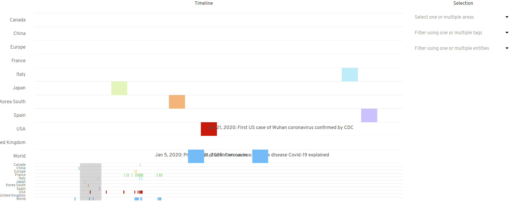

# Coronavirus Policies Timeline

> Keeping track of available information and actions taken by government worldwide relative to the SARS-CoV-2 pandemic (_i.e._ _Coronavirus_ or _covid-19_) responsible for various healthcare system failure.

## Onboarding

In the project directory, you can run:

### Events

| key                             | description               | example                                                                                                                                                             |
| ------------------------------* | ------------------------- | ------------------------------------------------------------------------------------------------------------------------------------------------------------------- |
| `published_date`                | source's publication date | `2020-03-03T21:06:04`                                                                                                                                               |
| `url`                           | source URL                | [https://www.liberation.fr/…](https://www.liberation.fr/france/2020/03/03/penurie-de-masques-les-autorites-n-ont-pas-vu-plus-loin-que-le-bout-de-leur-nez_1780489), |
| `title`                         | source article title      | _Pénurie de masques : les autorités n’ont pas vu plus loin que le bout de leur nez_                                                                                 |
| [`entity`](src/types/entity.ts) | who is speaking           | see [types/entity.ts](src/types/entity.ts) for possible values                                                                                                      |
| [`tags`](src/types/tag.ts)      | about what?               | see [types/tag.ts](src/types/tag.ts) for possible values                                                                                                            |

### Run

    yarn start

<!-- make serve-backend
make serve-frontend -->

Open [http://localhost:3000](http://localhost:3000) to view it in the browser.

### Credits

* [Timeline using D3 V5](https://observablehq.com/@ltmylinh/timeline-using-d3-v5) ;
* [Timeline of the 2019–20 coronavirus pandemic](https://www.wikiwand.com/en/Timeline_of_the_2019%E2%80%9320_coronavirus_pandemic) ;
* [Collection of selected COVID-19 novel coronavirus(SARS-CoV-2) related articles, categorized by date](https://www.covid19-archive.com/)
* [D3-Annotation with D3 Line Chart, Adding Annotations to Charts](https://observablehq.com/@hydrosquall/d3-annotation-with-d3-line-chart)
* [Timeline of the Coronavirus Pandemic and U.S. Response](https://www.justsecurity.org/69650/timeline-of-the-coronavirus-pandemic-and-u-s-response/)